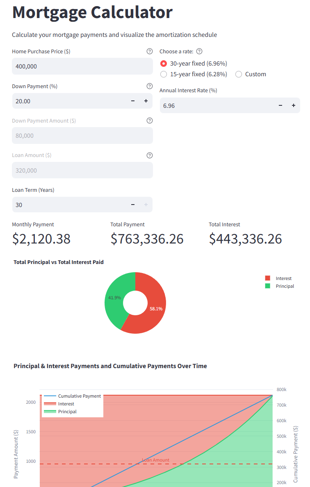

# Mortgage Calculator

A Streamlit application that helps users calculate mortgage payments and visualize the amortization schedule.

## Features

- Calculate monthly mortgage payments
- Visualize principal vs interest payments over time
- View detailed amortization schedule
- Interactive input parameters for loan amount, interest rate, and term

## Installation

1. Clone this repository
2. Install the required dependencies:
```bash
pip install -r requirements.txt
```

## Running the Application

To run the application, execute:
```bash
streamlit run app.py
```

The application will open in your default web browser. If it doesn't, you can access it at http://localhost:8501

## Usage

1. Enter the loan amount
2. Set the loan term in years
3. Input the annual interest rate
4. Click "Calculate" to see the results
5. View the visualization and detailed amortization schedule 